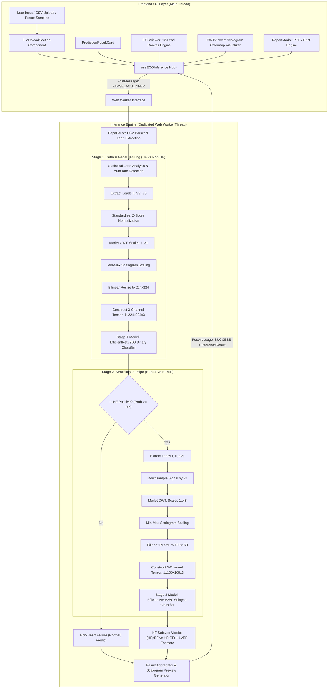
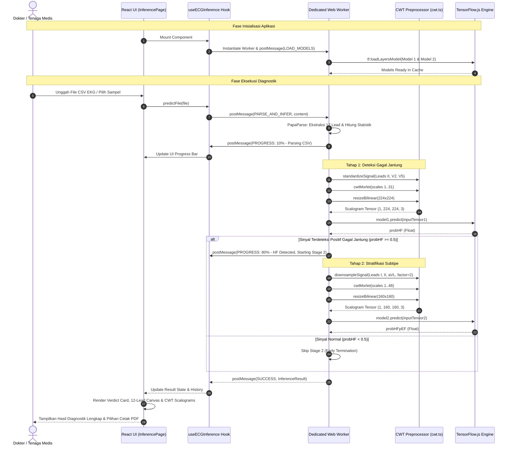

# Dokumen Arsitektur & Analisis Integrasi Machine Learning
## Aplikasi DiaSys CardioAI (12-Lead ECG Diagnostic System)

---

## 1. Ringkasan Eksekutif & Paradigma Arsitektur

**DiaSys CardioAI** adalah platform Clinical Decision Support System (CDSS) berbasis kecerdasan buatan (*Artificial Intelligence*) yang dirancang untuk mendeteksi dan mengklasifikasikan kondisi **Gagal Jantung (Heart Failure / HF)** serta subtipe klinisnya (**HFpEF vs HFrEF**) dari rekaman sinyal elektrokardiogram 12-lead (12-Lead ECG).

### Paradigma Arsitektur: *Client-Side Edge AI Execution*
Berbeda dengan arsitektur web konvensional yang mengirimkan data mentah medis ke server backend terpusat via REST API / gRPC, sistem ini mengadopsi pendekatan **In-Browser / Edge Client-Side Machine Learning Architecture** menggunakan **TensorFlow.js** dan **Dedicated Web Workers**.

```
  ┌────────────────────────────────────────────────────────────────────────┐
  │                           BROWSER CLIENT                               │
  │                                                                        │
  │  ┌─────────────────────────┐         ┌──────────────────────────────┐  │
  │  │    React 19 UI Layer    │         │     Web Worker AI Engine     │  │
  │  │                         │         │                              │  │
  │  │  • Upload & Benchmark   │ Message │  • PapaParse CSV Signal      │  │
  │  │  • Canvas 12-Lead ECG   │ Channel │  • Morlet CWT Preprocessor   │  │
  │  │  • 2D CWT Scalogram     │ ──────► │  • Stage 1 CNN (HF vs Non-HF)│  │
  │  │  • Verdict & Report PDF │ ◄────── │  • Stage 2 CNN (pEF vs rEF)  │  │
  │  └─────────────────────────┘         └──────────────────────────────┘  │
  └────────────────────────────────────────────────────────────────────────┘
```

#### Keunggulan Pendekatan Ini:
1. **Privasi & Keamanan Data Medis 100% (*Zero Data Leakage*)**: Data biometrik sinyal EKG pasien tidak pernah ditransmisikan melalui jaringan internet ke server eksternal, sepenuhnya selaras dengan standar regulasi medis (HIPAA / GDPR).
2. **Kemandirian Komputasi (*Zero Server Cost*)**: Tidak memerlukan server GPU backend yang mahal untuk inferensi; beban komputasi terdistribusi langsung ke peramban pengguna (*WebGL / WebAssembly / CPU acceleration*).
3. **Kemampuan Offline Penuh (*Offline-First*)**: Model dan aset komputasi yang telah ter-cache di browser dapat menjalankan inferensi tanpa ketergantungan koneksi internet aktif.

---

## 2. Diagram Arsitektur Sistem Menyeluruh

Berikut adalah representasi arsitektur sistem dari hulu (pemasukan data) hingga hilir (visualisasi klinis):



---

## 3. Analisis Sistem Komputasi & Pemrosesan ML (Engine / "Backend")

Meskipun berjalan di sisi klien (*client-side*), modul pemrosesan sinyal dan inferensi diabstraksikan menyerupai arsitektur backend mikro yang independen di dalam **Web Worker**.

### 3.1. Thread Isolation & Web Worker (`ecgInference.worker.ts`)
Pemrosesan sinyal matematika berdimensi tinggi dan inferensi model deep learning membutuhkan daya komputasi intensif. Jika dijalankan di *Main UI Thread*, aplikasi akan mengalami *UI freezing* dan *frame drops*.

* **Mekanisme Pesan**: Menggunakan protokol `WorkerRequest` dan `WorkerResponse` via `postMessage`.
* **Pelaporan Progres Real-Time**: Worker secara bertahap memancarkan event `PROGRESS` dengan detail langkah (`reading_file` $\rightarrow$ `parsing_csv` $\rightarrow$ `loading_model1` $\rightarrow$ `preprocessing_stage1` $\rightarrow$ `inferring_stage1` $\rightarrow$ `preprocessing_stage2` $\rightarrow$ `inferring_stage2` $\rightarrow$ `complete`).

```typescript
// Worker Request Protocols
export type WorkerRequest =
  | { type: 'PARSE_AND_INFER'; fileContent: string; fileName: string }
  | { type: 'LOAD_MODELS' };

// Worker Response Protocols
export type WorkerResponse =
  | { type: 'PROGRESS'; data: InferenceProgress }
  | { type: 'SUCCESS'; result: InferenceResult }
  | { type: 'ERROR'; error: string };
```

### 3.2. Pemuat Model & Adaptasi Custom Layer TFJS
Model diekspor dari arsitektur Keras/TensorFlow versi 3.x ke format TensorFlow.js LayersModel (`model.json` + *binary weight shards* `group1-shard*of6.bin`).

Untuk menjamin kompatibilitas runtime TFJS dengan model Keras 3.x modern, worker mengimplementasikan registrasi layer kustom:
1. `CustomNormalization`: Mengimplementasikan normalisasi mean dan variance channel input ($[0.485, 0.456, 0.406]$ dan $\sigma$).
2. `CustomRescaling`: Layer penskalaan linear tensor ($f(x) = x \cdot \text{scale} + \text{offset}$).
3. `CustomLambda`: Layer manipulasi tensor kustom ($f(x) = 2x - 1$).
4. `createModelIOHandler()`: Custom fetch loader yang secara otomatis memetakan ulang penamaan bobot layer `DepthwiseConv2D` (`kernel` $\rightarrow$ `depthwise_kernel`) yang berbeda antara Keras 3 dan TensorFlow.js runtime.

---

### 3.3. Engine Matematika Pemrosesan Sinyal & CWT (`cwt.ts`)

Alih-alih memproses sinyal EKG 1D mentah yang rentan terhadap *baseline wander* dan *noise* frekuensi tinggi, DiaSys mengonversi sinyal 1D menjadi matriks **2D Waktu-Frekuensi (Scalogram)** menggunakan **Continuous Wavelet Transform (CWT) dengan Morlet Wavelet analitik**.

#### 1. Morlet Wavelet Formulasi Matematika
$$\psi(t) = \pi^{-1/4} e^{i \omega_0 t} e^{-t^2 / 2}$$
Di mana implementasi sistem melakukan diskritisasi presisi tinggi ($N = 4096$ titik) dari fungsi Morlet terintegrasi $\text{intPsi}$ pada batas $[-8.0, 8.0]$:

$$\text{psi}[i] = e^{-0.5 x^2} \cdot \cos(5.0 x)$$

```typescript
// Prekomputasi wavelet Morlet terintegrasi sekali saat inisialisasi
const MORL_PRECISION = 12;
const MORL_N = 1 << MORL_PRECISION; // 4096 points
const MORL_LB = -8.0;
const MORL_UB = 8.0;
const MORL_STEP = (MORL_UB - MORL_LB) / (MORL_N - 1);
```

#### 2. Pipeline Transformasi Sinyal ke Tensor Gambar
Setiap channel lead EKG yang dipilih mengalami langkah-langkah berurutan:
1. **Z-Score Standardization per Lead**:
   $$z(t) = \frac{x(t) - \mu_x}{\sigma_x + \epsilon}$$
2. **Morlet CWT 1D Discrete Convolution**:
   Konvolusi diskrit 1D sinyal terhadap skala wavelet $s \in [s_{\min}, s_{\max}]$, diikuti oleh diferensiasi dan ekstraksi magnitude absolut $|\text{coef}|$.
3. **Min-Max Scalogram Normalization**:
   Normalisasi energi spektogram ke rentang intensitas pixel $[0, 1]$:
   $$\text{Scalogram}_{\text{norm}} = \frac{S - S_{\min}}{S_{\max} - S_{\min}}$$
4. **Bilinear Matrix Resizing (Pillow-compatible)**:
   Matriks hasil CWT berukuran $(\text{scales} \times \text{samples})$ diinterpolasi secara bilinear menjadi resolusi input tensor target ($(224 \times 224)$ untuk Stage 1 atau $(160 \times 160)$ untuk Stage 2).

---

### 3.4. Two-Stage Cascaded Deep Learning Architecture

Sistem menggunakan pendekatan kaskade 2 tahap (*Two-Stage Cascade*) yang memecah problem diagnosis menjadi dua keputusan berurutan:

```
                  ┌──────────────────────────────┐
                  │    12-Lead ECG Signal Input   │
                  └──────────────┬───────────────┘
                                 │
                                 ▼
                  ┌──────────────────────────────┐
                  │    STAGE 1: SCREENING MODEL  │
                  │   Leads: Lead II, V2, V5     │
                  │   Input: (1, 224, 224, 3)    │
                  │   Backbone: EfficientNetV2B0 │
                  └──────────────┬───────────────┘
                                 │
                     [ Probability >= 0.5 ? ]
                                 │
                ┌────────────────┴────────────────┐
                │ YES                             │ NO
                ▼                                 ▼
┌──────────────────────────────┐   ┌──────────────────────────────┐
│  STAGE 2: SUBTYPE MODEL      │   │     NON-HEART FAILURE        │
│  Leads: Lead I, II, aVL      │   │     (Status Normal)          │
│  Input: (1, 160, 160, 3)     │   │     Pipeline Terminated      │
│  Backbone: EfficientNetV2B0  │   └──────────────────────────────┘
└───────────────┬──────────────┘
                │
    [ Probability >= 0.5 ? ]
                │
        ┌───────┴───────┐
        │ YES           │ NO
        ▼               ▼
┌──────────────┐ ┌──────────────┐
│    HFpEF     │ │    HFrEF     │
│ (LVEF ≥ 50%) │ │ (LVEF ≤ 40%) │
└──────────────┘ └──────────────┘
```

#### Spesifikasi Model Komparatif:

| Parameter | **Stage 1 (HF Detection)** | **Stage 2 (Subtyping)** |
| :--- | :--- | :--- |
| **Tujuan Klinis** | Skrining Gagal Jantung vs Non-HF (Normal) | Klasifikasi Subtipe HFpEF vs HFrEF |
| **Dataset Pelatihan** | PTB-XL ECG Database (PhysioNet) | EchoNext Database (Echocardiogram-confirmed) |
| **Lead Terpilih** | **Lead II, Lead V2, Lead V5** (RGB) | **Lead I, Lead II, Lead aVL** (RGB) |
| **Sampling & Panjang** | 1000 sampel (10s @ 100Hz) | Downsampled 2x (1250 sampel) |
| **Rentang Skala CWT** | Skala $1 \dots 31$ (31 skala) | Skala $1 \dots 48$ (48 skala) |
| **Resolusi Input Tensor** | $(1, 224, 224, 3)$ | $(1, 160, 160, 3)$ |
| **Arsitektur Backbone** | **EfficientNetV2B0** (Transfer Learning) | **EfficientNetV2B0** (Transfer Learning) |
| **Classification Head** | Dense(128, ReLU) + Dropout(0.4) + Dense(1, Sigmoid) | Dense Head + Dropout(0.3) + Dense(1, Sigmoid) |
| **Metrik Evaluasi** | AUC, Accuracy, Sensitivity, Precision | Accuracy, AUC, Specificity |
| **Efisiensi Komputasi** | Menjadi filter pertama; jika negatif, Stage 2 diabaikan | Hanya dipanggil jika Stage 1 positif HF |

---

## 4. Analisis Sistem Antarmuka Pengguna (UI / Frontend System)

Sistem antarmuka dibangun dengan **React 19**, **TypeScript**, **Vite**, dan **Tailwind CSS v4**, mengusung desain bertema *Deep Clinical Emerald & Dark Slate* yang ergonomis bagi tenaga medis.

```
src/
├── App.tsx                    # Router utama (Landing Page & Diagnostic Hub)
├── pages/
│   └── InferencePage.tsx      # Halaman kerja utama asesmen diagnostik EKG
├── hooks/
│   └── useECGInference.ts     # Hook orkestrasi Web Worker & state manajemen
├── components/
│   ├── Navbar.tsx             # Navigasi atas, status badge & modal triggers
│   ├── FileUploadSection.tsx  # Pemasukan file CSV (Drag-drop & Preset Klinis)
│   ├── PredictionResultCard.tsx # Visualisasi hasil vonis model & kalkulasi EF
│   ├── ECGViewer.tsx          # Rendering Canvas 2D sinyal 12-Lead EKG interaktif
│   ├── CWTViewer.tsx          # Visualisasi matriks 2D Scalogram (Multi-colormap)
│   ├── ReportModal.tsx        # Pratinjau & Cetak Laporan Rekam Medis PDF
│   ├── ModelMethodologyModal.tsx # Penjelasan arsitektur AI & privasi data
│   ├── HistoryModal.tsx       # Riwayat asesmen diagnostik sesi aktif
│   └── LandingPage.tsx        # Halaman informasi produk & edukasi
├── workers/
│   └── ecgInference.worker.ts # Worker thread komputasi TFJS & CWT
├── utils/
│   └── cwt.ts                 # Algoritma matematika Morlet Wavelet & Resize
└── types/
    └── ecg.ts                 # Definisi tipe data & kontrak interface
```

### 4.1. Hook Integrasi: `useECGInference.ts`
Hook kustom ini berfungsi sebagai jembatan *stateful* antara komponen UI React dan thread Web Worker:
* **Inisialisasi & Preload**: Menginstansiasi worker dan mengirim sinyal `LOAD_MODELS` di latar belakang saat aplikasi dimuat pertama kali.
* **Eksposisi State**: Mengembalikan status reaktif `{ isInferring, progress, result, error, history, predictFile, predictFromUrl, resetState }`.
* **Penyimpanan Riwayat Sesi**: Menyimpan hingga 10 hasil diagnosis terakhir secara lokal di memori aplikasi untuk perbandingan cepat.

---

### 4.2. Komponen UI Utama & Fungsionalitas Klinis

#### 1. `FileUploadSection.tsx` (Pemasukan Data & Sampel Benchmark)
* Menyediakan zona *drag-and-drop* file CSV rekaman sinyal EKG 12-lead.
* Menyediakan pemilih sampel tolok ukur instan (*clinical benchmark presets*):
  - *Sampel Klinis HFpEF* (Pasien Gagal Jantung dengan Fraksi Ejeksi Normal $\ge 50\%$).
  - *Sampel Klinis HFrEF* (Pasien Gagal Jantung dengan Fraksi Ejeksi Rendah $\le 40\%$).
* Menampilkan *progress bar* animasi dengan indikator persentase dan teks tahapan pemrosesan waktu nyata.

#### 2. `PredictionResultCard.tsx` (Kartu Hasil Vonis Diagnostik)
* **Vonis Warna Adaptif**:
  - 🟢 **Emerald**: *Non-Heart Failure (Normal)* — Morfologi normal.
  - 🟡 **Amber**: *HFpEF (Preserved EF)* — Disfungsi diastolik, estimasi $\text{LVEF} \ge 50\%$.
  - 🔴 **Rose**: *HFrEF (Reduced EF)* — Disfungsi sistolik, estimasi $\text{LVEF} \le 40\%$.
* **Metrik Keyakinan & Penjelasan Klinis**: Menampilkan probabilitas prediksi numerik, level keyakinan (*High/Moderate*), dan implikasi patofisiologis.
* **Stage Breakdown**: Menampilkan perincian terpisah hasil inferensi Tahap 1 (Skrining) dan Tahap 2 (Subtipe).

#### 3. `ECGViewer.tsx` (Engine Rendering Gelombang EKG 12-Lead)
* Menggunakan **HTML5 Canvas 2D API** berkinerja tinggi untuk me-render ribuan titik data sinyal tanpa *lag*.
* **Grid Medis Standar**:
  - Kotak Kecil ($1\,\text{mm} = 0.04\,\text{s} \times 0.1\,\text{mV}$).
  - Kotak Besar ($5\,\text{mm} = 0.2\,\text{s} \times 0.5\,\text{mV}$).
* **Mode Layout Fleksibel**:
  - `3x4 Standard Lead Grid`: Format standar klinik 12-lead $(I, II, III, aVR, aVL, aVF, V1-V6)$.
  - `Stacked View`: Menumpuk semua 12 sinyal dalam satu garis waktu horizontal.
  - `Single Lead Zoom View`: Fokus mendalam pada lead terpilih dengan kontrol perbesaran (*zoom in/out*).
* **Hover Tooltip**: Menampilkan nilai voltase ($\text{mV}$) dan waktu ($\text{ms}$) secara presisi pada posisi kursor.

#### 4. `CWTViewer.tsx` (Visualisasi Spektrogram Skalogram 2D)
* Me-render matriks hasil transformasi CWT Morlet ke elemen Canvas secara langsung menggunakan `ImageData`.
* **Pilihan Colormap Interaktif**:
  - `Turbo`: Peta warna spektrum tinggi untuk kontras energi tajam.
  - `Viridis`: Standar ilmiah perseptual seragam.
  - `Inferno`: Peta kontras hitam-ke-kuning untuk mendeteksi puncak frekuensi.
  - `Plasma`: Peta warna spektrum magenta-oranye.
* Memfasilitasi dokter memvalidasi fitur morfologi waktu-frekuensi yang digunakan CNN dalam mengambil keputusan.

#### 5. `ReportModal.tsx` (Generator Dokumen Rekam Medis Klinis)
* Menghasilkan dokumen laporan klinis CDSS lengkap yang memuat identitas rekaman, ringkasan sinyal 12-lead, vonis AI dua tahap, parameter statistik voltase (min, max, mean, std, peak-to-peak), serta catatan interpretasi dokter.
* Dilengkapi aturan CSS `@media print` untuk mencetak langsung ke kertas fisik atau mengekspor ke format **PDF Medis**.

---

## 5. Sequence Diagram: Alur Eksekusi Inferensi



---

## 6. Struktur Data & Kontrak Antarmuka (Data Contract)

Berikut adalah kontrak tipe data TypeScript utama yang mengikat seluruh subsistem:

```typescript
// Hasil Akhir Diagnosis Lengkap
export interface InferenceResult {
  id: string;
  timestamp: string;
  fileName: string;
  parsedECG: ParsedECGData;
  stage1: Stage1Result;
  stage2?: Stage2Result;
  scalograms: ScalogramPreview[];
  inferenceDurationMs: number;
}

// Data Sinyal & Statistik 12-Lead EKG
export interface ParsedECGData {
  fileName: string;
  sampleCount: number;
  samplingRate: number; // 100Hz atau 250Hz
  durationSeconds: number;
  leads: Record<StandardLeadName, number[]>;
  leadStats: Record<StandardLeadName, LeadStats>;
}

// Hasil Inferensi Tahap 1
export interface Stage1Result {
  isHF: boolean;
  hfProbability: number;
  nonHfProbability: number;
  classification: 'HEART FAILURE (HF)' | 'NON-HEART FAILURE (Normal)';
  confidenceLevel: 'High' | 'Moderate' | 'Low';
}

// Hasil Inferensi Tahap 2
export interface Stage2Result {
  subtype: 'HFpEF' | 'HFrEF';
  hfpefProbability: number;
  hfrefProbability: number;
  classification: 'HFpEF (Preserved EF)' | 'HFrEF (Reduced EF)';
  lvefEstimate: string; // e.g. 'Estimated LVEF ≥ 50%' vs 'Estimated LVEF ≤ 40%'
  clinicalImplication: string;
}
```

---

## 7. Evaluasi Sistem & Rekomendasi Masa Depan

### Keunggulan Desain:
1. **Zero Latency & Efisiensi Server**: Eksekusi lokal menyelesaikan seluruh pipeline CWT dan inferensi 2-tahap dalam waktu $\approx 300\text{--}800\,\text{ms}$ di laptop standar tanpa beban server.
2. **Kepatuhan Privasi Data**: Menghilangkan risiko kebocoran data rekam medis pasien sesuai standar etika medis.
3. **Stabilitas Thread**: Web Worker menjaga UI tetap responsif 60 FPS selama komputasi matriks berat berlangsung.

### Rekomendasi Pengembangan Lanjutan:
1. **Akselerasi WebGPU**: Migrasi backend TensorFlow.js dari WebGL ke WebGPU untuk mempercepat inferensi model hingga $3\times\text{--}5\times$.
2. **WebAssembly (WASM) untuk CWT**: Mengompilasi fungsi konvolusi Morlet Wavelet dari C++/Rust ke WebAssembly untuk memangkas waktu kalkulasi sinyal berdurasi panjang ($>10.000$ sampel).
3. **Dukungan Format Sinyal Standar Rumah Sakit**: Menambahkan parser langsung untuk file berformat `.dat`/`.hea` (WFDB PhysioNet), `.edf` (European Data Format), dan XML/DICOM-ECG.
